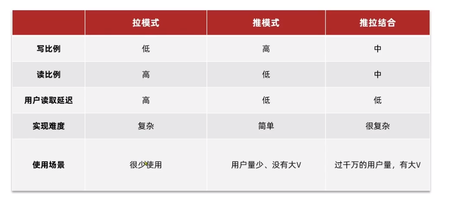

# 短信登录

## 基于Session实现

+ 生成短信验证码
  + 对用户手机号的合法性进行校验

  + 生成验证码

  + 将验证码保存在Session中

  + 将验证码发送给用户
  
    
  
+ 短信验证码登录与注册

  + 对用户手机号的合法性进行校验
  + 查询验证码和Session中存储的验证码是否一致
  + 根据手机号从数据库中查询用户，判断用户是否存在以决定是否需要创建新用户
  + 将用户信息保存到Session
  + <font color=red>不需要给用户返回SessionID！！！Tomcat服务器会自动实现</font>

  

+ 校验登录状态

  + 从用户的请求头中获取cookie，从cookie中获取SessionId
  + 判断是否能根据SessionId从Session中获取到用户
  + 将存在的用户保存到本地缓存（ThreadLocal）中
  + 将获取到的用户信息返回给用户


**基于Session的方法存在的问题：**

+ Session共享问题：在集群中，不同的服务器节点有自己的内存空间和状态，来自同一客户端的请求可能会分配到不同节点。
  + 如果不同服务器节点之间没有实现session同步，那么用户状态就丢失了。
  + 如果不同服务器节点之间实现了session同步，那么就需要考虑数据一致性问题，多个节点存储同样数据带来的内存浪费问题，同步数据所带来的额外性能开销问题，以及同步过程中增加的安全风险


## 基于Redis实现

+ 生成短信验证码

  + 对用户手机号的合法性进行校验

  + 生成验证码

  + 将验证码保存在Redis中（以手机号为key，验证码为value）

  + 将验证码发送给用户

    

+ 短信验证码登录与注册

  + 对用户手机号的合法性进行校验

  + 从Redis中查询手机号对应的验证码和用户发来的验证码是否匹配

  + 判断手机号是否存在以决定是否需要创建新用户

  + 将用户信息保存到Redis（以随机token为key，用户信息为value（hash类型））

    【为什么要用随机token？因为这个token是登录凭证，用户的请求头中会携带这个token，如果用手机号的话会出现**隐私泄漏的风险**】

  + 将token发送给用户

  

+ 校验登录状态（这块最后由登录拦截器实现）

  + 从用户请求头中获取Token
  + 以Token为key从Redis中获取用户数据
  + 判断用户是否存在
  + 将存在的用户保存到ThreadLocal中

  

<font size=4>**和Session方案的区别：**</font>

+ 生成验证码后将验证码保存到Redis而不是Session，保存内容的Key为手机号，value为验证码
+ 保存用户到Redis时key为随机token，value为用户信息，并且需要将token返回给前端（sessionID不需要返回，tomcat服务器会自动维护）
+ 校验登录状态时，前端携带token作为key，并且从redis中获取用户信息


## 功能优化

### 数据传输对象模式

+ 将数据返回给前端页面时使用DTO类简化数据传输，隐藏敏感信息，同时减少传输的数据量
+ 使用BeanUtil.copyProperties静态方法批量拷贝数据


### 登录校验拦截器

**基本实现**

+ 将登录校验拦截器注册到Web框架中的拦截器链中，由于不是所有的请求路径都需要拦截（有的页面即使不登陆也可以访问），所以要将这些路径在注册时用.excludePathPatterns排除在外
+ 创建拦截器（继承于HandlerInterceptor类），对preHandle功能和afterCompletion进行重写
+ 对于preHandle方法，需要每次获取请求头中的token
  + 判断token是否为空，不为空就根据token去Redis中查找用户
  + 查找到用户后将用户信息从Redis存储的格式转换成UserDTO格式
  + 将UserDTO存储到ThreadLocal
  + 刷新Redis中token的有效期
+ 对于afterCompletion方法
  + 从UserHolder中移除user


**优化实现**

如果只用一层拦截器，那么如果用户登录后一直访问不登录就可以访问的页面时，就不会触发拦截器中的preHandle方法，相应的token有效期就不会被刷新，所以需要将一层拦截器结构改成**链式拦截器结构**

+ 在拦截器配置表中用order设置两个拦截器的优先级
  + 拦截器1，拦截一切路径，用于刷新token有效期
  + 拦截器2，拦截需要登录的路径，用于登录拦截
+ 拦截器1中通过首先通过请求头中的"authorization"字段获取token
  + 如果token不存在，说明用户没登陆过，直接放行。
  + 如果token存在，则根据token获取Redis中的用户属性。
    + 如果用户不存在，直接放行。
    + 如果用户存在，则保存用户信息到ThreadLocal并刷新token过期时间。
+ 拦截器2，查看ThreadLocal中是否存在用户，不存在则拦截，存在则放行。


chatgpt：如果不用拦截器链的话可以:

把登录校验移出拦截器

使用过滤器

使用springSecurity


# 商户查询缓存

## 基础实现

+ 根据商铺id，从Redis中查询商铺缓存
  + 若命中，直接返回商铺信息
  + 若未命中，根据id查询数据库，判断商铺是否存在
    + 如果商铺存在，则将商铺数据写入Redis，并返回商铺信息
    + 如果商铺不存在，返回404

## 功能优化

基础实现中存在一些问题：

1. 缓存堆积。数据一直存在缓存中，没有设置过期时间。
2. 数据一致性。如果用户每次都命中了缓存，就不会查询数据库，数据库中的内容发生改变时，用户无法获取到最新的数据。除此之外还涉及数据库和缓存数据更新的顺序问题


### 缓存更新

+ 从数据库中查询到数据写入缓存时添加一个过期时间（作为兜底方案）
+ 每次对数据库进行更新操作时，更新数据库，再删除缓存中的数据。等下次执行了查询操作再将更新后的数据写入缓存。
+ 将更新数据库和删除缓存作为一个Transactional


### 解决缓存穿透

**布隆过滤器**适用于需要预先过滤大量无效请求的场景，在用户规模大并且存在大量高并发请求的情况效果会更好。实现复杂。

**缓存空对象**适用于用户规模比较小的业务场景，实现简单。

**增强基础格式校验：**在查询缓存前对用户提供的信息先进行基础格式校验，是一种主动预防缓存穿透的机制


在本项目中使用了<font color=red>缓存空对象+基础格式校验</font>的解决方案

- 根据商铺id，从Redis中查询商铺缓存
  - 若命中，<font color=red>判断是否为空值</font>
    - 若是空值则结束操作
    - 若不是空值，则返回商铺信息
  - 若未命中，根据id查询数据库，判断商铺是否存在
    - 如果商铺存在，则将商铺数据写入Redis，并返回商铺信息
    - 如果商铺不存在，<font color=red>则将空值写入Redis</font>


### 解决缓存雪崩

**给不同key设置不同的过期时间：**


### 解决缓存击穿

**基于互斥锁**的解决方案解决实现起来比较简单，但是请求比较多的时候就会出现大量请求排队等待的情况，影响系统的吞吐量。更适用于**对数据一致性要求较高**，且**并发度不高的场景**，能够确保数据的可靠性和一致性。【一些**变动比较频繁**的数据可以用这种方案来维护】

**基于逻辑过期**的解决方案更适用于对并发度要求较高，且对数据一致性要求不严格的场景，能够提高系统的性能和可扩展性。【**变动不是很频繁**的数据可以用这种方案来维护】


**基于互斥锁解决**

+ 根据商铺id，从Redis中查询商铺缓存

  + 若命中，则直接返回商铺数据
  + 若未命中，则尝试获取互斥锁

+ 若获取互斥锁失败，则休眠一段时间后再次尝试查询Redis中的商铺缓存

+ 若获取互斥锁成功，则根据id获取商铺数据.

  + 如果数据不存在，就返回错误，将空对象写入缓存
  + 如果数据存在，就将对象写入缓存，并返回对象
  + 释放锁

  

**基于逻辑过期解决**

+ 根据商铺id，从Redis中查询商铺缓存

  + 若未命中，则返回空（由于key设置了逻辑过期字段，没有设置TTL，如果缓存中没有就说明数据库里也没有）

  + 若命中，判断缓存是否过期

    + 未过期则返回商铺信息
    + 过期则尝试获取互斥锁

  + 若未成功获取互斥锁，则直接返回商铺信息

  + 若成功获取互斥锁，则开启独立线程完成查询和写入Redis的操作，由独立线程释放锁，其自身返回缓存中的商铺信息
  
    
  


# 优惠券秒杀

## 实现秒杀下单

+ 提交优惠券id，查询优惠券信息
+ 判断秒杀是否开始
  + 未开始，返回错误信息
  + 已开始，判断库存是否充足
    + 库存不足，则返回错误信息
    + 库存充足，扣减库存，创建订单，返回订单id


## 解决超卖问题


## 实现一人一单

+ 提交优惠券id

+ 查询优惠券信息

+ 判断秒杀是否开始

  + 否，返回异常结果
  + 是，判断库存是否充足

+ 若库存不充足则返回错误结果；若库存充足，则根据优惠券id和用户id查询订单

+ 判断订单是否存在

  + 是，返回异常结果
  + 否，扣减库存

  

## 秒杀优化

**优化思路：**

在优惠券秒杀的整个业务流程当中，因为有多次写数据库的操作，如果串行执行流程的话会导致业务执行速度降低。所以考虑将串行的业务交给不同的线程处理，同时提高对秒杀资格判断的效率。


# 达人探店

一个用户只能点赞一次，再次点赞就应该显示点赞取消。所以需要实现以下的业务逻辑。之所以要用Zset而不是set，是因为需要为点赞的用户实现一个排行榜功能（按点赞的时间毫秒值顺序显示点赞用户）

## **判断用户是否点赞**

+ 获取当前用户
  + 如果用户没有登录，直接返回
  + 如果用户已经登录了，则获取用户Id
+ 根据用户Id判断当前用户是否点赞
  + 如果没有点赞，就在数据库中将点赞数+1，并且给Zset中的用户Id添加当前时间毫秒值作为score
  + 如果点赞了，就在数据库中将点赞数-1，并且从Zset中移除用户对应的Id


## **查询博文的点赞**

+ 查询点赞的用户set
  + 如果set是null或者set是空，就返回空列表
  + 如果set不为空，就从Set中获取所有的用户id组成的列表
+ 根据用户的id列表查询用户实体类的列表
+ 将实体类的列表返回给前端

注意：在根据用户id列表查询用户实体类列表时，如果直接使用listByIds返回的列表会按照id升序排列，而我们实际上需要根据店在哪的时间毫秒值进行排列，所以需要使用query进行自定义查询。

```java
List<UserDTO> userDTOS = userService.query()
                .in("id", ids).last("ORDER BY FIELD(id," + idStr + ")").list()
                .stream()
                .map(user -> BeanUtil.copyProperties(user, UserDTO.class))
                .collect(Collectors.toList());
```


# 好友关注

## **查询是否关注**

+ 获取当前用户id
+ 查询当前用户是否关注了xx用户
+ 如果关注了就返回true


## **关注和取关**

+ 获取当前用户id
+ 判断到底是关注还是取关
  + 如果状态是未关注，就新增一条关注数据。将被关注的用户id放入缓存
  + 如果状态是已关注，就从数据据库中删除对应的数据。将被关注的用户id移出缓存


## **查询共同关注**

+ 获取当前用户的Id
+ 获取目标用户的Id
+ 从Redis中查询这两个Id对应的关注列表的Set
+ 求这两个Set的交集
  + 如果交集为空，直接返回空
  + 如果交集不为空
+ 将map解析为id的列表
+ 根据id列表查询用户列表
+ 返回用户列表


**关注推送**

+ 

----------------

<font size=5>**Feed流**</font>

feed流即持续更新并呈现给用户内容的信息流，是将用户主动订阅的若干消息源组合在一起形成内容聚合器，帮助用户持续地获取最新的订阅源内容。


**Feed流分类**

+ Timeline：不做内容筛选，简单地按照内容发布时间排序。
+ 智能排序：利用智能算法屏蔽违规的，用户不感兴趣的内容。推送用户感兴趣的信息。


**Feed流的实现模式：**

+ 拉模式（读扩散）:

  用户发布数据时将数据存入自己的发件箱，当其他用户需要读取时再主动将数据拉取到自己的收件箱里

+ 推模式（写扩散）：

  用户发布数据时直接将数据推送到其他用户的收件箱里

+ 推拉结合：

  对活跃用户采用推模式，非活跃用户采用拉模式




## 基于Feed流实现推送

基于Feed流实现。

+ 获取当前登录用户
+ 为blog设置用户的id
+ 保存blog
  + 如果保存失败，返回错误信息
  + 如果保存成功，则获取关注了当前用户的所有follow
+ 从follow里获取粉丝的Id
+ 以粉丝的id为key，推送的内容为value，时间毫秒值为score。将数据存入redis


## 滚动分页

滚动分页本次查询的命令和上一次查询的命令有关，所以查询过后需要返回的内容还应该包括【本次查询的推送的最小时间戳】以及【偏移量】

+ 获取当前用户
+ 从Redis中根据用户ID找到用户的收件箱
+ 从收件箱中获取TypedTuple，再从TypedTuple中获取value【BlogId】，以及所有TypedTuple中最小的score【时间戳】，顺便获取score和最小时间戳相同的元素个数
+ 根据id查询【记得要加orderBy保证返回值的有序性】
+ 将结果封装成DTO类

# 附近商铺

<font size=5>**GEO**</font>

Geolocation的简称，代表地理坐标，在Redis3.2中加入了对GEO的支持，允许存储地理坐标信息，帮助实现经纬度检索。


## 附近商家搜索


# 用户签到


# UV统计

